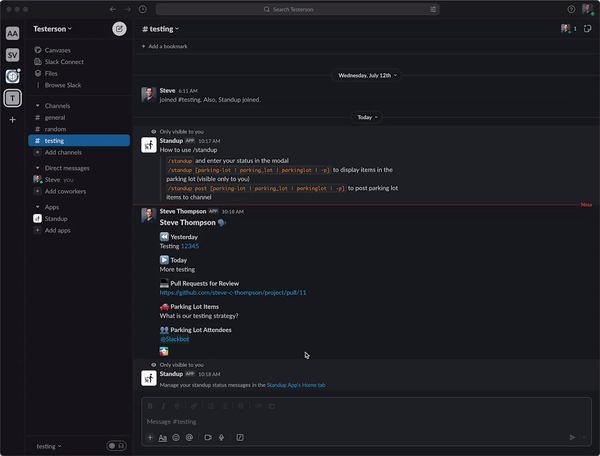

<h1 align="center">Standup Slack App</h1>
<p>
  
  <a href="#" target="_blank">
    
  </a>
</p>

> This is a Slack app to post daily standup status, for teams that wish to hold offline standups. It launches a modal, prompting users for Yesterday, Today, Parking Lot Items, Parking Lot Participants, and Pull Requests for Review.
> 
> Users can schedule standup statuses to post at a specific time, or post immediately. They can edit their standup messages on the App's Home Tab.
>
> In this offline standup process, "Parking Lot" is a face-to-face meeting scheduled at a regular time, which allows a subset of team members to meet and discuss issues. Prior to this meeting, a user can post the Parking Lot items to notify team members that their presence is required.

## Standup Modal
The app launches a modal for data entry.


Details of the modal are shown below.


| Part 1/2 | Part 2/2 |
| -- | -- |
|||

> While standup messages appear to come from the user, they are actually created by the app, using the user's avatar and name.

## Parking Lot
Any user can post the day's parking lot items for a channel. This will `@` all users who were tagged for parking lot discussion. 


## Home Tab
Users can edit statuses from the App's Home tab.

> The Home tab is drawn from the user's status entries in the App's database. Status entries exist in the database for one day. Upon posting a status, the Home tab is redrawn with available statues, so statuses from earlier days will no longer display.




## Installation
Add the app to channels where you wish to use it.


Or invite the bot to the channel with `@Standup`.

## Usage - Slack
```sh
/standup help
/standup [parking-lot | parking_lot | parkinglot | -p]- display ephemeral parking lot items
/standup post [parking-lot | parking_lot | parkinglot | -p] - post parking lot items to chat
```

## Slack Configuration
The app must be configured on the Slack website. Slack has a tutorial for creating apps at https://api.slack.com/start/quickstart.

1. Create an App
1. **The easiest way to configure this app is to update URLs in this project's `slack_manifest.yml` and import the file.**

_Steps below are listed for informational reference._

This bot uses a **Slash Command**, **Home Tab**, and enabled **Interactivity**.


_Note: this slash command is connected to the lambda function in `app.ts`_
```
app.command("/standup",...
```


* Slash Commands and Interactivity use the same Request URL, which ends in `/slack/events`
* For local testing, set these to the URL generated by `ngrok`. See _Local Development_ below for details.
* When the app is live, set these to the lambda URL

The app needs permissions to interact with the Slack workspace. Enable OAuth scopes in Slack.


* `chat:write`
* `chat:write.customize`
* `commands`
* `groups:read`
* `users.profile:read`
* `users:read`
* `channels:read`

Once scopes exist, **Install to Workspace**.


The **Home Tab** must be enabled in _App Home_.


## Deployment
[SLS](https://www.serverless.com/) makes it easy to deploy to AWS

Install with the command

```
npm install -g serverless
```

```
sls deploy --stage (prod | dev) [--aws-profile profile-name] [--region us-east-2]
```

To inspect the size and content of the deployment without deploying anything to AWS
```
sls package --stage (prod | dev) [--aws-profile profile-name]
```

You can also check configuration substitutions. This is useful for checking things like the target `region`.
```
sls print --stage (prod | dev)
```

### Secrets
Create a secret in SecretsManager named `SlackStandup-secret-dev` or `SlackStandup-secret-prod`, depending on the target environment, with the values

* `SLACK_STANDUP_BOT_TOKEN`
* `SLACK_STANDUP_SIGNING_SECRET`

These can be found on the Slack website. Copy-paste the following values.

#### SLACK_STANDUP_BOT_TOKEN
In the app's _OAuth & Permissions_:


#### SLACK_STANDUP_SIGNING_SECRET
In the app's _Basic Settings_ copy the value for _Signing Secret_:


## Local Development
Testing locally requires Docker, and setting the following environment variables in a `.env` file. These are the same values found in the **Secrets** section of this document.

* `SLACK_STANDUP_TOKEN`
* `SLACK_STANDUP_SIGNING_SECRET`

Deploy to Docker with the following command:
```sh
npm run serverless-localstack
```
This retrieves the local environment variables and creates secrets and a DynamoDB table in the Localstack instance.

Localstack runs on port `4566`.

### Script Permissions
Localstack is loaded with scripts in `src/test/scripts`. These may need updated permissions to execute.

```sh
chmod 755 src/test/scripts/*
```

### Slack -> Locally running Lambda
To connect Slack to this running instance, start [ngrok](https://ngrok.com/) with either of these commands. This assumes `ngrok` is installed, and is a command in the user's path.

```sh
npm run ngrok

ngrok http 5000
```

This will create a URL to enter into Slack's _Slash Command_ and _Interactivity & Shortcuts_ interfaces for this app.

### Querying DynamoDB
The `context.ts` file sets up some fake credentials, and we need these to query the DynamoDB instance using the [aws cli](https://awscli.amazonaws.com/v2/documentation/api/latest/reference/dynamodb/index.html#cli-aws-dynamodb).

This command will scan the local DynamoDB instance for all items the table `local_STANDUP_STATUS`.
```
AWS_ACCESS_KEY_ID=not-a-real-access-key-id AWS_SECRET_ACCESS_KEY=not-a-real-access-key aws dynamodb scan --table-name local_STANDUP_STATUS  --endpoint-url http://localhost:4566
```

## Known Issues
Scheduling a message after a Daylight Savings Time boundary will say it's scheduled at the time you selected, but show a different (correct) time on the home screen. It is scheduled at the time you selected, so it's just a formatting issue when the message is scheduled.
## Author

👤 **Steve Thompson**


## Show your support

Give a ⭐️ if this project helped you!

***
_This README was generated with ❤️ by [readme-md-generator](https://github.com/kefranabg/readme-md-generator)_